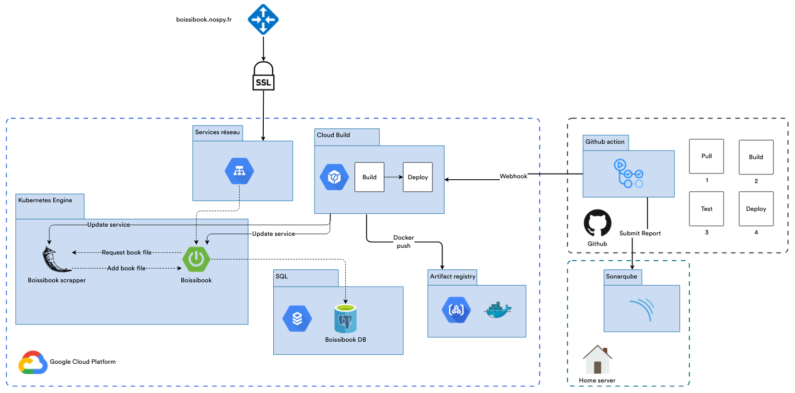
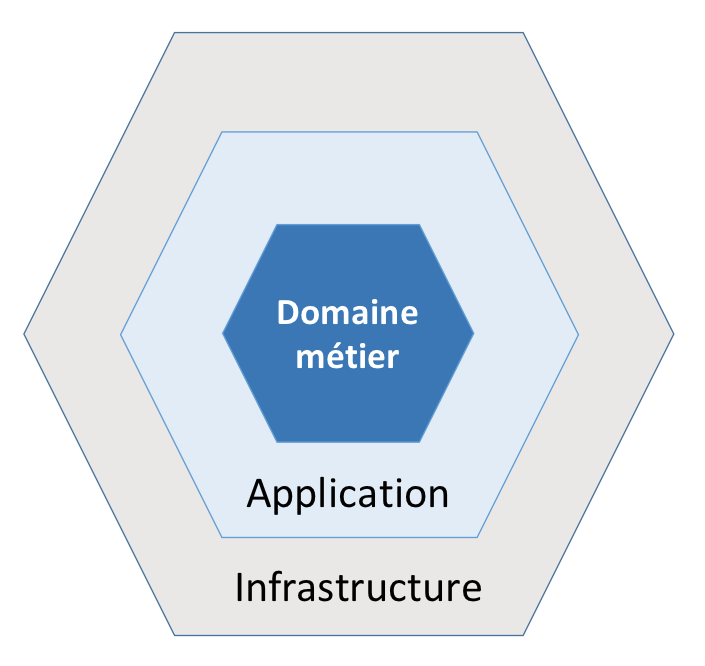
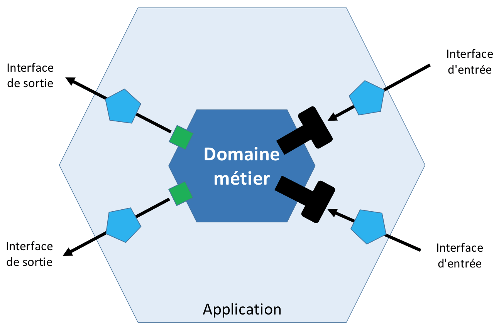

# Boissibook

| [](https://sonar.nospy.fr/dashboard?id=Nouuu_Boissibook&branch=dev) | [](https://sonar.nospy.fr/dashboard?id=Nouuu_Boissibook&branch=dev) | [](https://sonar.nospy.fr/dashboard?id=Nouuu_Boissibook&branch=dev) | [](https://sonar.nospy.fr/dashboard?id=Nouuu_Boissibook&branch=dev) | [](https://sonar.nospy.fr/dashboard?id=Nouuu_Boissibook&branch=dev) | [](https://sonar.nospy.fr/dashboard?id=Nouuu_Boissibook&branch=dev) | [](https://sonar.nospy.fr/dashboard?id=Nouuu_Boissibook&branch=dev) |
|-----------------------------------------------------------------------------------------------------------------------------------------------------------------------------------------------------------------------------------------------------|----------------------------------------------------------------------------------------------------------------------------------------------------------------------------------------------------------------------------------------------------------|----------------------------------------------------------------------------------------------------------------------------------------------------------------------------------------------------------------------------------------------------|-----------------------------------------------------------------------------------------------------------------------------------------------------------------------------------------------------------------------------------------------|------------------------------------------------------------------------------------------------------------------------------------------------------------------------------------------------------------------------------|--------------------------------------------------------------------------------------------------------------------------------------------------------------------------------------------------------------------------------------------|--------------------------------------------------------------------------------------------------------------------------------------------------------------------------------------------------------------------------------------|

<!-- toc -->

<!-- tocstop -->

## Concept

C'est un utilitaire pour gérer sa collection de livres, à la manière d’un myanimelist, book collector.

On peut gérer sa liste de livre, ses statuts de lecture, son avancement…

Petit aspect social où l’on peut noter un livre et voir la moyenne de ce dernier donné par les différents utilisateurs.
Il sera aussi possible de laisser un commentaire (publique ou pas).

Petite fonctionnalité pour pouvoir télécharger l’ebook, et l'ajouter, si on le possède, pour le partager aux autres
utilisateurs (tout à fait légal, oui oui.). On pourrait également scraper quelques sites pour essayer de le trouver si
on ne le possède pas grâce à un utilitaire intégré (de mieux en mieux !).

### Idées de nom

- Boissibook
- Kindle surprise, Kindle bueno, maxi ... 😏
- ...

### Api de recherche de livres

[Google Books APIs](https://developers.google.com/books/docs/v1/using)

[Open Library](https://openlibrary.org/)

## Dépôts Github

- [Boissibook](https://github.com/Nouuu/Boissibook)
- [Application Swift](https://github.com/RemyMach/boissibook-swift)
- [Scrapper Zlib](https://github.com/RemyMach/Boissibook-scraper)

## Architecture Google Cloud Platform & CI/CD

L'application est entièrement déployée sur Google Cloud Platform, avec une infrastructure de déploiement automatique.



## Features

### Gestion des utilisateurs

Ce usecase est assez classique, elle permet de gérer les utilisateurs.

Un utilisateur est défini par les propriétés suivantes :

```json
{
  "userId": {
    "type": "string",
    "description": "The user's id"
  },
  "email": {
    "type": "string",
    "description": "The user's email",
    "example": "gregory@mail.com"
  },
  "name": {
    "type": "string",
    "description": "The user's name",
    "example": "Gregory"
  }
}
```

#### Fonctionnalités

Les différentes fonctions sont les suivantes :

- Créer un utilisateur
- Modifier un utilisateur
- Supprimer un utilisateur
- Supprimer tous les utilisateurs
- Récupérer un utilisateur
- Récupérer un utilisateur par son email
- Récupérer la liste des utilisateurs
- Compter le nombre d’utilisateurs

### Gestion des livres

Feature permettant de chercher un livre, l’ajouter à la base s’il n’existe pas encore et récupérer les informations de
ce dernier (y compris sa note et les commentaires publics laissés par les utilisateurs).

Un livre est défini par les propriétés suivantes :

```json
{
  "id": {
    "type": "string"
  },
  "title": {
    "type": "string"
  },
  "authors": {
    "type": "array",
    "items": {
      "type": "string"
    }
  },
  "publisher": {
    "type": "string"
  },
  "publishedDate": {
    "type": "string"
  },
  "description": {
    "type": "string"
  },
  "isbn13": {
    "type": "string"
  },
  "language": {
    "type": "string"
  },
  "imgUrl": {
    "type": "string"
  },
  "pages": {
    "type": "integer",
    "format": "int32"
  }
}
```

#### Fonctionnalités

Les différentes fonctions sont les suivantes :

- Chercher un livre en une ligne (qui pourra prendre aussi bien le nom d’un livre que celui d’un auteur, d’un genre)
  .
- Chercher en ligne par ISBN
- Enregistrer un livre en base (par ISBN)
- Chercher un livre en base en une ligne (qui pourra prendre aussi bien le nom d’un livre que celui d’un auteur,
  d’un genre).
- Supprimer un livre en base
- Récupérer les informations d’un livre en base (par ISBN)
- Récupérer les commentaires (public) d’un livre en base (par ISBN)

### Readlist

Feature permettant à un utilisateur de gérer sa bibliothèque et ses livres en cours de lecture.

Une review est définie par les propriétés suivantes :

```json
{
  "bookProgressionId": {
    "type": "string",
    "description": "The id of the readlist item",
    "example": "7bd1b206-833d-4378-8064-05b162d80764"
  },
  "bookId": {
    "type": "string",
    "description": "The id of the book",
    "example": "7bd1b206-833d-4378-8064-05b162d80764"
  },
  "userId": {
    "type": "string",
    "description": "The id of the user",
    "example": "7bd1b206-833d-4378-8064-05b162d80764"
  },
  "readingStatus": {
    "type": "string",
    "description": "The reading status of the book",
    "example": "READING"
  },
  "visibility": {
    "type": "string",
    "description": "The visibility of the review",
    "example": "PUBLIC"
  },
  "currentPage": {
    "type": "integer",
    "description": "The number of the current page",
    "format": "int32",
    "example": 12
  },
  "note": {
    "type": "integer",
    "description": "The note given to the book",
    "format": "int32",
    "example": 5
  },
  "comment": {
    "type": "string",
    "description": "The comment of the review",
    "example": "This book is awesome"
  }
}
```

#### Fonctionnalités

Les différentes fonctions sont les suivantes :

- Récupérer une review par son id
- Mettre à jour sa review sur un livre
- Supprimer sa review sur un livre
- Ajouter une review sur un livre
- Mettre à jour son statut de lecture sur un livre
- Mettre à jour sa note sur un livre
- Mettre à jour son commentaire sur un livre
- Mettre à jour sa progression sur un livre
- Récupérer toutes les reviews d’un utilisateur
- Récupérer toutes les reviews d’un livre

### Téléchargement et envoie du livre

La fonctionnalité phare et tout à fait légale (🤡) de Boissibook. Il est possible d'ajouter sa propre version numérique
d'un livre.<br/>
Si vous ne possédez pas le livre, pas de problème ! Un autre utilisateur l'a peut être déjà ajouté à votre place. Sinon,
vous pouvez demander à Boissibook de tenter de le télécharger pour vous (dans la limite du quota de 5 par jours).

Un fichier de livre est défini par les propriétés suivantes :

```json
 {
  "id": {
    "type": "string",
    "description": "Book file id"
  },
  "name": {
    "type": "string",
    "description": "Book file name"
  },
  "type": {
    "type": "string",
    "description": "Book file type"
  },
  "bookId": {
    "type": "string",
    "description": "Book id"
  },
  "userId": {
    "type": "string",
    "description": "User who uploaded id"
  },
  "downloadCount": {
    "type": "integer",
    "description": "File download count",
    "format": "int32"
  }
}
```

#### Fonctionnalités

- Ajouter sa version numérique d'un livre
- Trouver un fichier via Zlib
  → [Scrapper Zlib](#scrapper-zlib)
- Récupérer la liste des liens de téléchargement (ordonnée par nombre de téléchargements) d'un livre
- Récupérer le nombre de fichiers de livres disponibles pour un livre
- Supprimer un fichier livre
- Télécharger un livre

### Achievements

Pour un peu plus de FUN, Boissibook propose des achievements. Ces derniers s'obtiennent lorsque vous avez terminé un
certain nombre de livres ou qu'un de vos livres ajouté à la bibliothèque a été téléchargé plusieurs fois.

### Scrapper Zlib

Scrapper python, utilisé par l’application Spring pour parcourir Zlib et télécharger le bouquin grâce à son nom, ISBN.

- [FastAPI](https://fastapi.tiangolo.com/)
- [Selenium](https://fr.acervolima.com/principes-de-base-de-selenium-python/)
- Ou [beautifulsoup](https://www.crummy.com/software/BeautifulSoup/bs4/doc/)

Une fois le fichier du livre récupéré
→ [Téléchargement / Envoie du livre ](#téléchargement-et-envoie-du-livre)

## Choix d'implémentations

### Hexagonal architecture

L’objectif principal de l’architecture hexagonale est de découpler la partie métier d’une application de ses services
techniques. Ceci dans le but de préserver la partie métier pour qu’elle ne contienne que des éléments liés aux
traitements fonctionnels. Cette architecture est aussi appelée “Ports et Adaptateurs” car l’interface entre la partie
métier et l’extérieur se fait, d’une part, en utilisant les ports qui sont des interfaces définissant les entrées ou
sorties et d’autre part, les adaptateurs qui sont des objets adaptant le monde extérieur à la partie métier.

#### Architecture en couche

L’architecture hexagonale préconise une version simplifiée de l’architecture en couches pour séparer la logique métier
des processus techniques.



La logique métier doit se trouver à l’intérieur de l’hexagone. Nous prenons plusieurs concepts en compte pour affiner
cette architecture tel que :

- Inversion de dépendances
- Couche applicative
- Couche infrastructure
- ...

La couche applicative ne doit contenir que le métier de notre application, toutes ses dépendances doivent ainsi être des
interfaces métiers, qui seront ensuite injectées et implémentées par la couche infrastructure.



### Diagrammes de séquence

### Tests

#### Tests d'architecture

#### Tests unitaires

#### Tests de contrat avec test container

#### Tests E2E